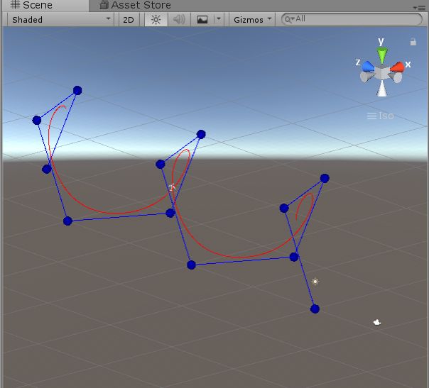
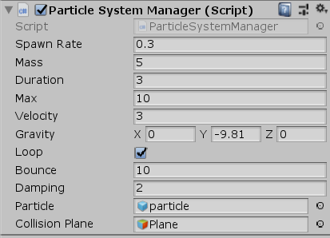
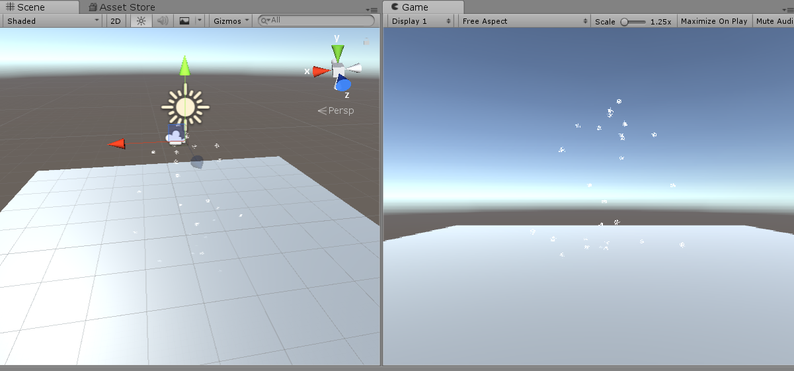
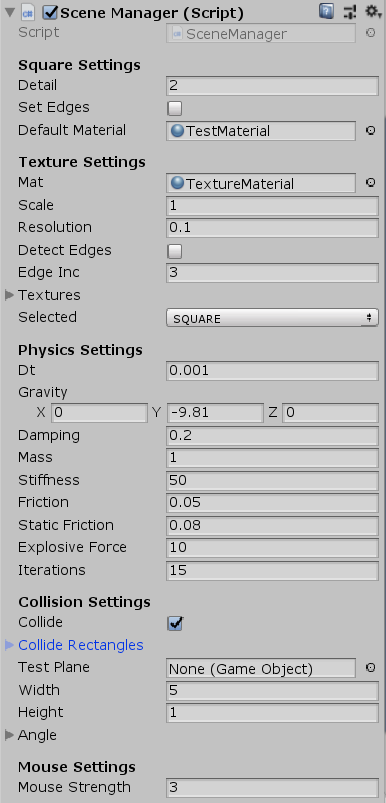
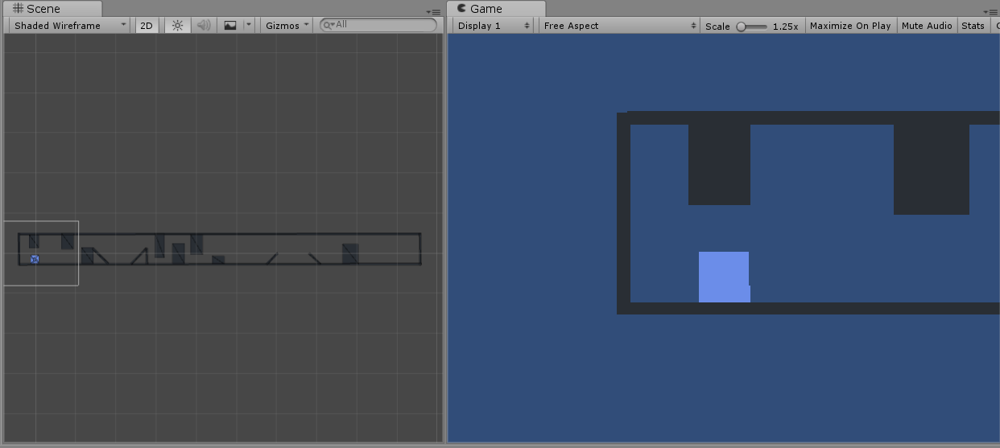
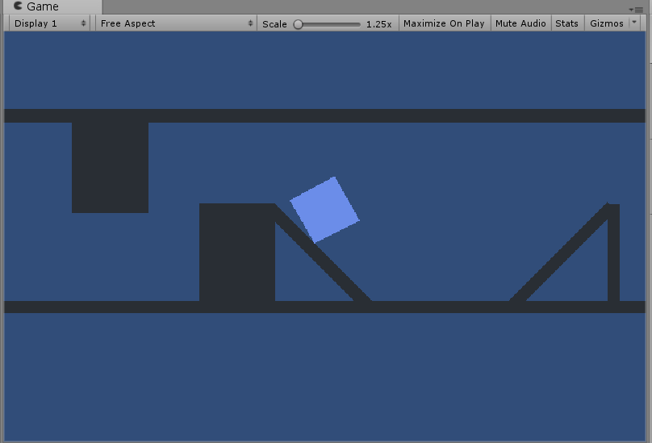

# Computer graphics projects
Projects for Computer graphics subject created in Unity game engine and are written in C#.

## Path Tracing
Animating an object so it follows a b-spline path created by a given number of control points.

## Particle System
Custom particle system with simple physics and collision involved.

## Object Deformation
This project is focused on object deformation in 2D and it is based on spring-mass system and delaunay triangulation. For testing and demonstration purposes an implementation of simple collision detection system is added to the application.

System has 2 scenes:

    • SampleScene – initial scene for testing
    • DemoScene – scene for mainly demonstration purposes, but can be also used for testing

Properties of object can be modified through editor to achieve a certain state of deformation, but each property should be changed carefully because for some numbers system can be unstable. By pressing the mouse button, velocity is added to the object and it will move in the direction of the mouse cursor.

